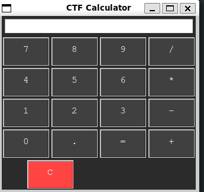

Sebastian Alin
# Planering cft-uppgift: **Älgvaluate**

Detta är planeringen av en ctf utamning (capture the flag), där man genom att använda olika tricks skall kunna komma åt en ctf sträng `ctf{<sträng>}` som man inte **borde** komma åt. Om man har fått strängen har man löst uppgiften.

## Table of Contents
- [Planering cft-uppgift: **Älgvaluate**](#planering-cft-uppgift-älgvaluate)
  - [Table of Contents](#table-of-contents)
  - [Beskrivning av uppgift](#beskrivning-av-uppgift)
    - [Komponenter](#komponenter)
    - [Säkerhetskoncept](#säkerhetskoncept)
  - [syfte](#syfte)
  - [Lösningsskiss](#lösningsskiss)
  - [uppskattad svårighetsgrad](#uppskattad-svårighetsgrad)
  - [Utväcklingspotential](#utväcklingspotential)
  - [Utvecklingspotential](#utvecklingspotential)

## Beskrivning av uppgift

Uppgiften består av en säkerhetsutmaning (CTF) där deltagaren ska:
1. Interagera med en miniräknar-app som körs på en SSH-server
2. Utnyttja en sårbarhet i `eval`-kommandot
3. Få åtkomst till serverns filsystem
4. Hitta och ladda ner en lösenordsskyddad ZIP-fil
5. Knäcka ZIP-filens lösenord
6. Extrahera metadata från en bild i ZIP-filen för att hitta CTF-flaggan

miniraknar interface

### Komponenter
- SSH-server med miniräknar-applikation
- Osäkert implementerat `eval`-kommando
- Lösenordsskyddad ZIP-fil
- Bild med dold metadata

### Säkerhetskoncept
- Command Injection via `eval`
- Brute-force av ZIP-lösenord
- Metadata-analys av bilder

## syfte
Syftet med denna CTF-uppgift är att:
- Lära ut praktiska tekniker för command injection och metadata-analys
- Demonstrera säkerhetsriskerna vid användning av eval i program
- Ge praktisk erfarenhet av att arbeta med SSH och fjärråtkomst
- Öka förståelsen för hur kryptering och lösenordsskydd fungerar
- Introducera verktyg för metadata-analys och dess roll i cybersäkerhet

## Lösningsskiss
1. **Initial Access**
    - Anslut till SSH-servern
    - Utforska miniräknar-gränssnittet

2. **Command Injection**
    - Identifiera eval-sårbarheten
    - Testa basic commands som `1+1`
    - Injicera system commands: `__import__('os').system('ls')`
    - Få shell access genom Python payload

3. **Filsystemsutforskning**
    - Lokalisera ZIP-filen med `find / -name "*.zip"`
    - Ladda ner filen med netcat eller base64-encoding

4. **ZIP Cracking**
    - Använd `fcrackzip` eller liknande verktyg
    - Brute-force lösenordet med ordlista
    - Extrahera innehållet

5. **Metadata Extraction**
    - Analysera bilden med `exiftool`
    - Hitta CTF-flaggan i metadata
    - Validera flaggformatet `ctf{...}`

## uppskattad svårighetsgrad

Svårighetsgraden uppskattas till **0.6** (60% förväntas klara uppgiften), vilket kan förändras i framtiden.

**Motivering**: Ingen av stegen i uppgiften är speceillt svåra i sig, men det kräver att man har kunskap om riskerna med eval. Dessutom måsta man veta Bruteforcar ett lösenord, samt hur man hittar metada i en bild.

## Utväcklingspotential
## Utvecklingspotential

1. **Svårare Command Injection**
    - Implementera basic input filtering
    - Blockera vanliga shell commands
    - Kräv mer avancerade bypass-tekniker

2. **Komplex ZIP-struktur**
    - Använd nested ZIP files
    - Implementera olika krypteringsmetoder
    - Göm filer i andra filformat

3. **Metadata Challenges**
    - Fördela flaggan över flera bilder
    - Kryptera metadata
    - Använd steganografi

4. **Server Hardening**
    - Begränsa användarrättigheter
    - Implementera timeouts
    - Lägg till IP-baserad rate limiting

5. **Extra Säkerhetslager**
    - Implementera honeypots 
    - Lägg till decoy files

