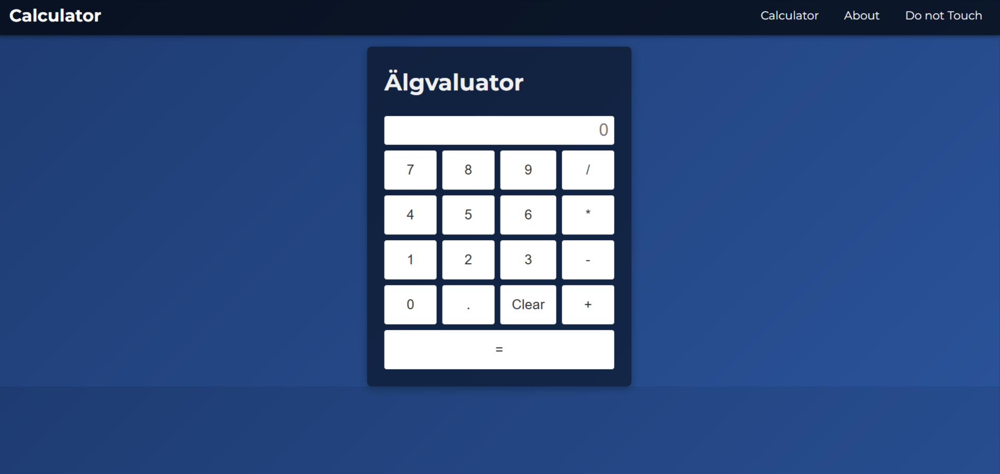
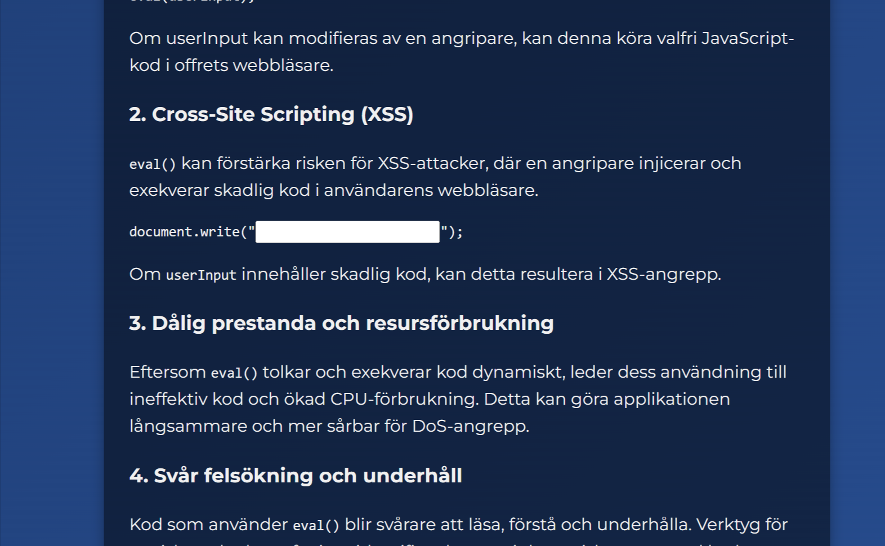

Sebastian Alin
# Rapport Cybersäkerhetsuppgift **Älgvaluate**

## Table of Contents
- [Rapport Cybersäkerhetsuppgift **Älgvaluate**](#rapport-cybersäkerhetsuppgift-älgvaluate)
  - [Table of Contents](#table-of-contents)
  - [Beskrivning av uppgift](#beskrivning-av-uppgift)
    - [Komponenter](#komponenter)
    - [Säkerhetskoncept](#säkerhetskoncept)
  - [syfte](#syfte)
  - [Lösningsskiss](#lösningsskiss)
  - [uppskattad svårighetsgrad](#uppskattad-svårighetsgrad)
  - [Utvärdering](#utvärdering)
    - [Reflektion](#reflektion)
  - [Utväcklingspotential](#utväcklingspotential)
    - [Förbättringsområden](#förbättringsområden)
    - [Möjligheter för att öka svårighetsgraden](#möjligheter-för-att-öka-svårighetsgraden)

## Beskrivning av uppgift

Uppgiften består av en säkerhetsutmaning (CTF) där deltagaren ska:
1. Interagera med en miniräknar-app via webben (`10.22.4.116`)
2. Utnyttja en sårbarhet i `eval`-kommandot för att komma åt
3. Få åtkomst till serverns filsystem
4. Hitta och ladda ner en lösenordsskyddad ZIP-fil
5. Knäcka ZIP-filens lösenord
6. Extrahera metadata från en bild i ZIP-filen för att hitta CTF-flaggan

Det första användaren kommer i webbaplikationen med en miniräknare och några, några andra onödiga sidor. Hemsidan hostas lokalt med Apache2 från en rasberry pi och har adressen `10.22.4.116`. När man val lyckats med injesringen i miniräknaren kommer andvändaren få upp en text som säger att användaren skall ansluta till ssh servern guest@10.22.4.116 med lösenordet guest.  



miniraknar interface


### Komponenter
- Apache2 webserver från Rasperrypi
- Osäkert implementerat `eval`-kommando
- SSH-server från Raspberrypi
- Lösenordsskyddad ZIP-fil, med hjälp av onlinevärktyget https://protectedzip.com/
- Bild  på älg med dold metadata. "./Files_for_ctf_creation/GenerateMetadata.py" användes för att skapa metadatan


### Säkerhetskoncept
- Command Injection via `eval`
- Brute-force av ZIP-lösenord
- Metadata-analys av bilder

## syfte
Syftet med denna CTF-uppgift är att:
- Lära ut praktiska tekniker för command injection och metadata-analys
- Demonstrera säkerhetsriskerna vid användning av eval i program
- Ge praktisk erfarenhet av att arbeta med SSH och fjärråtkomst
- Öka förståelsen för hur kryptering och lösenordsskydd fungerar
- Introducera verktyg för metadata-analys och dess roll i cybersäkerhet

## Lösningsskiss
1. **Initial Access**
     - Anslut till hemsdian[10.22.4.116](http://10.22.4.116)
       - Utforska hemsdian och miniräknar gränssnittet miniräknar-gränssnittet. 


1. **Command Injection**
    - Identifiera att kalkylatorn använder eval, då hemsdian hter Älgvaluate, och en av sidorna beskriver sårbarheterna med eval.

    - Testa basic commands som `1+1` och `alert("hello world")` för att se att det stämmer
    - testa injesera system komandon
    ```python
    __import__('os').system('ls')  # List files
    ```

    ```javascript
    require('child_process').execSync('ls')
    ```
    - Genom att inspektera html koden kan man hitta ledtrådar, som att man vill komma åt ett fil som heter `flag.txt`, och hur man kommr åt den.

    - Ledtråden är encodad i bas 64 som måste konverteras till text för att läsas. Detta kan göra lätte med en enkelt oython script eller wia olika hemsidor på [internet](https://www.base64decode.org/)
    - Genom att injesera koden nedan i miniräknaren kommer användaren asynkront hämta flaggan `(flag.txt)` och returnera värdet i input rutan.
  
    ```javascript
     fetch('flag.txt')
      .then(response => response.text())
      .then(text => document.getElementById('result').value = text)
    ```

1. **Filsystemsutforskning**
    - Användaren kommer nu får en text där hen skall ansluta till `guest@10.22.4.116` via ssh
    - I ssh server kommer visas ett antal olika kataloger där användare skall hitta och laddaner filen som heter `Hemligheter.zip`
    - Använd `scp` kommandot för att ladda ner filen:
    ```bash
    scp guest@10.22.4.116:/path/to/Hemligheter.zip ./
    ```
    - Alternativt kan man öppna en ssh connection från vs-code och ladda ner dårifrån.

2. **ZIP Cracking**
   - Zip filen som nu laddades ner är krytperad med ett "mycket starkt lösenord"
   - Använd `fcrackzip` eller [onlineverktyg](https://www.lostmypass.com/file-types/zip/) för att Brute-force lösenordet med ordlista.
   - Extrahera innehållet lösenordet `Admin`

3. **Metadata Extraction**
    - Convertera bilden från .heic till .png med en [filformatsomvandlare](https://cloudconvert.com/heic-to-png)
    - Analysera Metadatan bilden med exempelvis https://www.metadata2go.com/
    - Hitta CTF-flaggan i metadata
    - Validera flaggformatet `ctf{...}`

## uppskattad svårighetsgrad

Svårighetsgraden uppskattas till **0.6** (60% förväntas klara uppgiften), vilket kan förändras i framtiden.

**Motivering**: Ingen av stegen i uppgiften är speceillt svåra i sig, men det kräver att man har kunskap om riskerna med eval. Dessutom måsta man veta Bruteforcar ett lösenord, samt hur man hittar metada i en bild.

## Utvärdering

### Reflektion

Ett av de största problemen under utvecklingen var att jag arbetade direkt på Raspberry Pi via SSH. Detta medförde flera utmaningar:

- Avsaknad av GUI gjorde att jag behövde starta om Apache-servern manuellt vid varje uppdatering
- SSH-anslutningen krävde olika IP-adresser på olika platser
- 15-30 minuter förlorades varje gång jag behövde återansluta från en ny plats
- Ineffektiv utvecklingsprocess på grund av direktredigering via SSH

Detta hade kunnat undvikas genom att utveckla och testa lokalt först, för att sedan deploya till Raspberry Pi.

 Ursprungligen var uppgiften tänkt att baseras på ett Python-program (eval.py) där användaren skulle utnyttja eval-funktionen direkt. På grund av svårigheter med internethosting valde jag istället att implementera en webbapplikation. Detta medförde vissa begränsningar, särskilt gällande möjligheten att utforska systemfiler via eval-injektioner. Som lösning implementerades en SSH-server där användaren kunde fortsätta utmaningen efter den initiala eval-injektionen.

 Denna förändring adderade ett extra lager av komplexitet men gjorde också uppgiften mer realistisk ur ett cybersäkerhetsperspektiv.

Hemsidan utvecklades med ren HTML, CSS och JavaScript eftersom det var en enkel applikation som inte krävde avancerad funktionalitet. I efterhand hade utvecklingen kunnat effektiviseras genom att använda ett ramverk som Vue + Nuxt tillsammans med Tailwind CSS, vilket hade gjort det möjligt att snabbare iterera över designen och implementera en mer konsistent styling.


## Utväcklingspotential
1. Använd remverk när och css bilotek för konstruktion av hemsidan, då ett gör arbetsprosessen snabbare.
2. Testa och färigställ koden lokalt innan den hostas, då det bli lättare att arbeta.

### Förbättringsområden

3. **Server side code**
   - Att köra javascript koden server side istället för client side är både mer effectift, och ökar möjligheterna för olika eval sårbarheter, där användaren skall leta i filsystemet på servern istället för att conecta via `ssh`.
4. **Global hosting**
   - Hosta globalt iställect för lokalt så att utmaningen finns tillgänglig för alla oavsett när.
   - Istället för att hosta via Raspberry pi kan man också använda tjänster som hjälper att hosta på internet.
5. **Användar Rättighter**
   - Begränsa användarrättigheter när man skall hitta och ladda ner filer. Detta kräver att användaren har goda kunskaper i `bash` och skalkomandon.
6. **Ledtrådare**
     - Implementera fler och mer intresantal ledtrådar som hjälp för att lösa uppgiften
     - Gör ledtrådarna mer mer kryptiska istället för att säga mer eller mindre exakt vad man skall göra.

### Möjligheter för att öka svårighetsgraden

1. **Svårare Command Injection**
    - Filtrera bort farliga kommandon
    - Blockera vanliga skalkommandon.
    - Implementera whitelist för tillåtna tecken och operationer
    - Lägg till validering av indata längd
    - Sanera specialtecken från användarinput- Blockera vanliga shell commands
    - Kräv mer avancerade bypass-tekniker

2. **Komplex ZIP-struktur**
    - Använd nested ZIP files
    - Implementera olika krypteringsmetoder
    - Göm filer i andra filformat

3. **Metadata Challenges**
    - Fördela flaggan över flera bilder
    - Kryptera metadata
    - Använd steganografi

4. **Server Hardening**
    - Implementera timeouts
    - Lägg till IP-baserad rate limiting

5. **Extra Säkerhetslager**
    - Implementera honeypots
    - Lägg till decoy fler decoy filer


